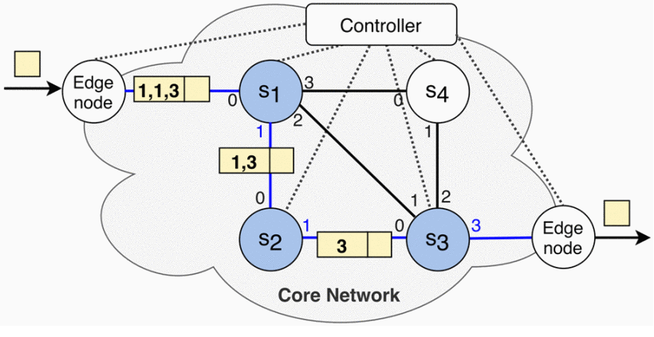

# PolKA - Polynomial Key-based Source Routing

Source routing (SR) is a prominent alternative to table-based routing for reducing the number of network states. However, traditional SR approaches, based on Port Switching, still maintain a state in the packet by using a header rewrite operation. The residue number system (RNS) is a promising way of executing fully stateless SR, in which forwarding decisions at core nodes rely on a simple modulo operation over a route label. Nevertheless, such operation over integer arithmetic is not natively supported by commodity network hardware. Thus, we propose a novel RNS-based SR scheme, named PolKA, that explores binary polynomial arithmetic using Galois field (GF) of order 2. We evaluate PolKA in comparison to Port Switching by implementing emulated and hardware prototypes using P4 architecture. Results show that PolKA can achieve equivalent performance, while providing advanced routing features, such as fast failure reaction and agile path migration.



For example, if we apply this scheme to the scenario of figure and assign nodeIDs 4, 3, 5, 7 to nodes s1,s2,s3 and s4, respectively, the routeID calculated according to RNS is 25. In this way, the output ports for s1,s2, and s3 are, respectively: (25 mod 4 = 1, (25 mod 3)= 1, and (25 mod 5)= 0.

## Preparing the environment

To download the VM image, we have to use the following link:

[[6.7GB Size] - Lubuntu 20.04 x64](https://drive.google.com/file/d/1oozRqFO2KjjxW0Ob47d6Re4i6ay1wdwg/view?usp=sharing) - Mininet-WiFi with P4 (_pass: wifi_)

After downloading, we have to perform the login (user: wifi, pass: wifi) and clone the repository as follows:

```sh
wifi@wifi-virtualbox:~$ git clone https://github.com/nerds-ufes/polka.git
```
