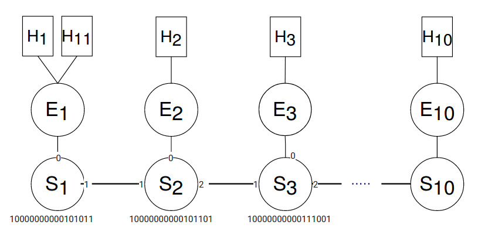

# PolKA - Polynomial Key-based Source Routing

## 1) Preparing the environment

To compile the P4 PolKA codes, you have to perform the following command:

```sh
wifi@wifi-virtualbox:~$ cd polka/mininet/polka
wifi@wifi-virtualbox:~/polka/mininet/polka$ make
```

Is import to note that for each mofification, we have to recompile by using the previous command.

## 2) Topology Description

This test explore a linear topology as shown in the figure below:



To create the topology by using Mininet, we have to perform the following command:

```sh
$ sudo python3 run_linear_topology.py
```

##  3) Generating a route-ID  

Installing the polka library by using PIP

```sh
$ python3 -m pip install polka-routing --user
```


Considering that reducible polynomials were already calculated, we can see the list "s" with node-ID definition for each node. Hence, as the first step, we have to set the transmission state for all of them. Therefore, the route-ID is a composition of a set of node-ID and transmission state.


```python
#!/usr/bin/env python3
from polka.tools import calculate_routeid, print_poly
DEBUG=False

def _main():
    print("Insering irred poly (node-ID)")
    s = [
        [1, 0, 0, 0, 0, 0, 0, 0, 0, 0, 0, 1, 0, 1, 0, 1, 1], # s1
        [1, 0, 0, 0, 0, 0, 0, 0, 0, 0, 0, 1, 0, 1, 1, 0, 1], # s2
        [1, 0, 0, 0, 0, 0, 0, 0, 0, 0, 0, 1, 1, 1, 0, 0, 1], # s3
        [1, 0, 0, 0, 0, 0, 0, 0, 0, 0, 0, 1, 1, 1, 1, 1, 1], # s4
        [1, 0, 0, 0, 0, 0, 0, 0, 0, 0, 1, 0, 0, 0, 1, 1, 1], # s5
        [1, 0, 0, 0, 0, 0, 0, 0, 0, 0, 1, 0, 1, 0, 0, 1, 1], # s6
        [1, 0, 0, 0, 0, 0, 0, 0, 0, 1, 0, 0, 0, 1, 1, 0, 1], # s7
        [1, 0, 0, 0, 0, 0, 0, 0, 0, 1, 0, 1, 1, 1, 1, 0, 1], # s8
        [1, 0, 0, 0, 0, 0, 0, 0, 0, 1, 1, 0, 1, 0, 1, 1, 1], # s9
        [1, 0, 0, 0, 0, 0, 0, 0, 0, 1, 1, 1, 1, 0, 1, 0, 1], # s10
    ]
    print("From h1 to h3 ====")
    # defining the nodes from h1 to h3
    nodes = [
        s[0],
        s[1],
        s[2]
    ]
    # defining the transmission state for each node from h1 to h3
    o = [
        [1, 0],     # s1
        [1, 0, 0],  # s2
        [1],        # s3
    ]
	print_poly(calculate_routeid(nodes, o, debug=DEBUG))
    
    print("From h3 to h1 ====")
    # defining the nodes from h1 to h3
    nodes = [
        s[2],
        s[1],
        s[0]
    ]
    # defining the transmission state for each node from h1 to h3
    o = [
        [1, 0],     # s3
        [1, 0],     # s2
        [1],        # s1
    ]

    print_poly(calculate_routeid(nodes, o, debug=DEBUG))

if __name__ == '__main__':
    _main()
```


Hence, to calculate the route-ID, we have to perform the script as follows:

```sh
$ python3 calc_routeid.py
Insering irred poly (node-ID)
From h1 to h3 ====
S=  [[1, 0, 0, 0, 0, 0, 0, 0, 0, 0, 0, 1, 0, 1, 0, 1, 1], [1, 0, 0, 0, 0, 0, 0, 0, 0, 0, 0, 1, 0, 1, 1, 0, 1], [1, 0, 0, 0, 0, 0, 0, 0, 0, 0, 0, 1, 1, 1, 0, 0, 1]]
O=  [[1, 0], [1, 0, 0], [1]]
Len:  48
Poly (list):  [1, 1, 0, 0, 1, 1, 0, 1, 1, 0, 1, 0, 0, 1, 1, 1, 1, 0, 1, 0, 1, 1, 1, 0, 1, 0, 0, 1, 1, 1, 1, 0, 0, 0, 1, 0, 0, 1, 0, 1, 0, 0, 0, 0, 1, 0, 1, 0]
Poly (int):  226120072832266
Poly (bin):  0b110011011010011110101110100111100010010100001010
Poly (hex):  0xcda7ae9e250a
From h3 to h1 ====
S=  [[1, 0, 0, 0, 0, 0, 0, 0, 0, 0, 0, 1, 1, 1, 0, 0, 1], [1, 0, 0, 0, 0, 0, 0, 0, 0, 0, 0, 1, 0, 1, 1, 0, 1], [1, 0, 0, 0, 0, 0, 0, 0, 0, 0, 0, 1, 0, 1, 0, 1, 1]]
O=  [[1, 0], [1, 0], [1]]
Len:  47
Poly (list):  [1, 0, 1, 0, 0, 1, 0, 0, 1, 0, 0, 0, 1, 0, 1, 0, 1, 1, 0, 1, 1, 0, 0, 1, 1, 1, 1, 0, 1, 1, 1, 1, 1, 1, 1, 0, 0, 0, 1, 0, 1, 1, 1, 0, 1, 1, 1]
Poly (int):  90458134409591
Poly (bin):  0b10100100100010101101100111101111111000101110111
Poly (hex):  0x52456cf7f177
```


After generating the route-ID for each path, we have to add the appropriate route-ID related to the destination. For instance, to the destination "h3", the following line in "e1" (edge node 1) must be modified as follows:

```sh
wifi@wifi-virtualbox:~/polka/mininet$ cd polka/config/
wifi@wifi-virtualbox:~/polka/mininet/polka/config$ cat e1-commands.txt
```


Edit the file "e1-commands.txt" and modify the route-ID to the destination "h3" (10.0.3.3/32) as follows:

```sh
table_set_default tunnel_encap_process_sr tdrop
table_add tunnel_encap_process_sr add_sourcerouting_header 10.0.1.11/32 => 3 0 00:00:00:00:01:0b 0
table_add tunnel_encap_process_sr add_sourcerouting_header 10.0.1.1/32 => 1 0 00:00:00:00:01:01 0
table_add tunnel_encap_process_sr add_sourcerouting_header 10.0.2.2/32 => 2 1 00:00:00:00:02:02 2147713608
table_add tunnel_encap_process_sr add_sourcerouting_header 10.0.3.3/32 => 2 1 00:00:00:00:03:03 103941321831683
table_add tunnel_encap_process_sr add_sourcerouting_header 10.0.4.4/32 => 2 1 00:00:00:00:04:04 11476003314842104240
table_add tunnel_encap_process_sr add_sourcerouting_header 10.0.5.5/32 => 2 1 00:00:00:00:05:05 51603676627500816006703
table_add tunnel_encap_process_sr add_sourcerouting_header 10.0.6.6/32 => 2 1 00:00:00:00:06:06 53859119087051048274660866727
table_add tunnel_encap_process_sr add_sourcerouting_header 10.0.7.7/32 => 2 1 00:00:00:00:07:07 2786758700157712044095728923460252
table_add tunnel_encap_process_sr add_sourcerouting_header 10.0.8.8/32 => 2 1 00:00:00:00:08:08 152639893319959825741646821899524043963
table_add tunnel_encap_process_sr add_sourcerouting_header 10.0.9.9/32 => 2 1 00:00:00:00:09:09 18161241477108940830924939053933556023686562
table_add tunnel_encap_process_sr add_sourcerouting_header 10.0.10.10/32 => 2 1 00:00:00:00:0a:0a 40134688781405407356790831164801586774996990884

```


As an outcome, the route-ID to the destination "h3" is equal "103941321831683".  For the route-ID from "h3" to "h1", we have to modify the "e3-commands.txt" file as follows:


```sh
wifi@wifi-virtualbox:~/polka/mininet$ cd polka/config/
wifi@wifi-virtualbox:~/polka/mininet/polka/config$ cat e3-commands.txt
```

```sh
table_set_default tunnel_encap_process_sr tdrop
table_add tunnel_encap_process_sr add_sourcerouting_header 10.0.1.1/32 => 2 1 00:00:00:00:01:01 90458134409591
```


As seen in the file "e3-commands", the route-ID to the destination "h1" is equal "90458134409591".  All the route-ID are generated via the previous Python script.
